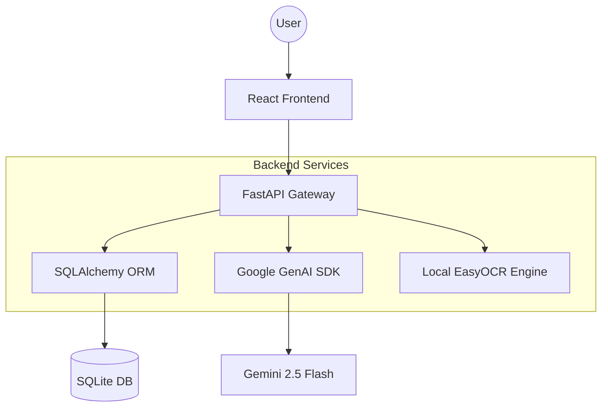

# 💎 Personal Finance Tracker: AI-Powered Financial Intelligence System

> **Project Submission for Intern Selection Round**  
> A high-performance, full-stack financial ecosystem featuring Generative AI analysis, automated OCR receipt parsing, and a custom-engineered design system.

## 🎬 Demo Video
**Watch the Personal Finance Tracker in action!**  

https://drive.google.com/drive/folders/1enO5MgRAnZfAc9pXlTegz1wcbR0iVyx1

For quick testing, a sample CSV dataset and receipt images are included in the shared Drive folder.
---

## 📑 Table of Contents
- [1. Executive Summary](#1-executive-summary)
- [2. SDLC & Engineering Methodology](#2-sdlc--engineering-methodology)
- [3. System Architecture & Tech Stack](#3-system-architecture--tech-stack)
- [4. Database Schema (ERD)](#4-database-schema-erd)
- [5. API Reference & Documentation](#5-api-reference--documentation)
- [6. Technical Deep-Dive & 'Extra' Features](#6-technical-deep-dive--extra-features)
- [7. Error Handling & Security](#7-error-handling--security)
- [8. Installation & Setup](#8-installation--setup)
- [9. Future Roadmap](#9-future-roadmap)

---

## 1. Executive Summary
**Personal Finance Tracker** is designed to bridge the gap between manual expense tracking and intelligent financial planning. While most trackers are reactive (showing past data), this system is **proactive**—using Gemini 2.5 to provide actionable wealth-building strategies and a local Tensor OCR engine to automate data entry from physical receipts.

### Why this project is different:
- **Zero-Friction Entry**: Dual-layer OCR ensures receipts are logged in seconds without typing.
- **Contextual Intelligence**: The AI "Co-Pilot" has full awareness of your historical balance, budgets, and savings goals.
- **Visual Excellence**: A custom-built "Soft Dark" UI focused on data density and high legibility.

---

## 2. SDLC & Engineering Methodology
This project followed a rigorous **Iterative Development Life Cycle**:

1.  **Requirement Analysis**: Identified the "Duplicate Entry" and "Missing Historical Context" problems common in basic finance apps.
2.  **Design Patterns**: Implemented a decoupled architecture with a **Repository-Service Pattern** in the backend for clean database abstractions.
3.  **Development Sprints**:
    *   **Sprint 1**: Backend CRUD, Pydantic Schema validation, and SQLite integration.
    *   **Sprint 2**: Frontend state management, custom theme system, and Recharts integration.
    *   **Sprint 3**: AI/ML integration (Google Gemini + EasyOCR).
    *   **Sprint 4**: Polishing UI (Skeleton Loaders, Micro-animations) and automated testing.
4.  **Verification**: Comprehensive test coverage for all critical financial logic (duplicates, budget tracking, carried savings) with 20+ automated test cases.

---

## 3. System Architecture & Tech Stack

### **The Architecture**
The system uses a modern **Client-Server architecture** with a focus on asynchronous performance:

The frontend communicates only with FastAPI, while AI, OCR, and database services remain fully encapsulated within the backend layer.

### **Tech Stack Rationale**
- **FastAPI**: Selected for its **asynchronous execution** and automatic OpenAPI/Swagger generation.
- **React.js**: Used for its component-driven architecture, enabling modular UI elements like the "Sliding Box" savings carousel.
- **SQLAlchemy**: Provides a robust ORM to prevent SQL injection and ensure type-safety.
- **EasyOCR**: A PyTorch-based OCR engine chosen for local, privacy-focused text extraction before falling back to the cloud.

---

## 4. Database Schema (ERD)
The database is normalized to ensure data integrity and optimized for period-aware querying.

- **Transactions**: `id`, `amount`, `description`, `category`, `timestamp`, `transaction_type` (Income/Expense), `auto_tagged`.
- **Budgets**: `id`, `category`, `monthly_limit`, `month`, `year`.
- **Savings Goals**: `id`, `name`, `target_amount`, `current_amount`, `created_at`.
- **Recurring Transactions**: `id`, `description`, `amount`, `frequency`, `next_due_date`.

### **Entity Relationships**
- **Budgets & Transactions**: One Budget definition monitors multiple transactions within its category.
- **Savings & Ledger**: Savings Goals maintain a separate transaction ledger to ensure locked funds don't mix with daily liquid balance.
- **Automation**: Recurring Transactions act as templates that automatically generate future Transaction entries.

---

## 5. API Reference & Documentation
The backend provides a fully documented REST API. Interactive docs are available at `http://localhost:8000/docs`.

### **Core Endpoints**
- **`GET /dashboard`**: Aggregates period-specific financial metrics (Income, Expenses, Balance, Carried Savings).
- **`POST /transactions/`**: Creates a new transaction with automatic NLP-based categorization and duplicate detection.
- **`PATCH /transactions/{id}/reclassify`**: Allows manual override of the AI-assigned category for a specific transaction.
- **`POST /transactions/bulk-delete`**: Performs batch removal of transactions using a list of unique identifiers.

### **Insights & AI**
- **`POST /ai/chat`**: Context-aware NLP assistant (Gemini 2.5) that analyzes user data to provide proactive advice.
- **`POST /ai/receipt`**: Advanced OCR endpoint that parses receipt images using a local+cloud hybrid engine.
- **`GET /report/pdf`**: Generates a professional, server-side financial statement in PDF format.

### **Budgeting & Savings**
- **`GET /budget/status`**: Real-time monitoring of category-wise spending against user-defined monthly limits.
- **`POST /savings/deposit`**: Transactional endpoint to allocate liquid funds towards a specific savings goal.
- **`POST /recurring/`**: Registers a subscription or bill template for automated future transaction generation.

All endpoints return structured JSON responses and are validated using Pydantic schemas.

---

## 6. Technical Deep-Dive & 'Extra' Features

### 🛡️ **Trick Logic: Duplicate Protection**
A proprietary backend rule ensures that if a transaction with the same amount and description is entered within **5 minutes**, it is flagged as a duplicate (HTTP 409) to prevent data corruption.

### 🧠 **AI Financial Co-Pilot**
Built with **Gemini 2.5 Flash Lite**, the assistant provides proactive advice:
- *Example:* "I see you've spent 80% of your Food budget in the first week. Try meal prepping to save ₹2000 this month."

### 📈 **Period-Aware Balance Tracking**
Unlike simple sum-based apps, our system calculates **Carried Savings**. It mathematically accounts for wealth retained from previous months to give a true "Cumulative Balance."

### 📷 **Dual-Layer OCR Engine**
To minimize manual entry, we implemented a sophisticated OCR pipeline:
- **Local Tensor OCR**: Uses **EasyOCR** (PyTorch-based) for high-speed local processing of text.
- **AI Fallback**: Automatically escalates to **Gemini 2.5** for complex, handwritten, or low-light receipts to maximize extraction accuracy.

---

## 7. Error Handling & Security

### **Error Handling Strategy**
- **Backend**: Uses custom **FastAPI Exception Handlers** to return structured JSON errors (400, 404, 409).
- **Frontend**: Global **Axios Interceptors** catch errors and trigger "Toast" notifications for real-time user feedback.
- **Validation**: Pydantic models enforce strict data types on every request.

### **Security Considerations**
- **Environment Safety**: Sensitive credentials like `GEMINI_API_KEY` are managed via `.env` files and never committed to version control.
- **Sanitization**: SQL-Alchemy protects against SQL Injection.
- **Privacy**: OCR processing is prioritized locally using EasyOCR before any data is sent to external AI APIs.

---

## 8. Installation & Setup

### **Prerequisites**
- Python 3.10+
- Node.js 18+

### **1-Click Setup (Windows)**
Run `setupdev.bat` to automatically:
1. Create a Python Virtual Environment (`env`).
2. Install all Backend dependencies (`pip`).
3. Install all Frontend dependencies (`npm`).
4. Initialize the SQLite database.

### **Run the App**
Run `runapplication.bat` to launch the full-stack system simultaneously.

---

## 🚀 Premium Extra Features (Beyond Requirements)
While the core requirements focused on basic CRUD and categorization, this project includes several high-impact "extra" features designed to provide a production-ready experience:

1.  **AI Financial Co-Pilot (Gemini 2.5)**: A context-aware NLP assistant that provides proactive, actionable advice.
2.  **Dual-Layer OCR Engine**: Automated receipt parsing with local EasyOCR + Gemini AI fallback.
3.  **Smart Savings Goals Module**: Interactive "Sliding Box" UI with integrated deposit/withdrawal ledgering.
4.  **Recurring Transaction Automation**: Built-in scheduler for subscription and bill tracking.
5.  **Premium UX: 'Soft Dark' System**: World-class design with Glassmorphism, Skeleton Loaders, and Micro-Animations.
6.  **Advanced Data Portability**: Server-Side PDF statement generation for professional reporting.
7.  **Undo System & Bulk Actions**: Safety-first UX with toast-based undo and efficient batch processing.
8.  **System Health Monitoring**: Real-time pulse-indicator for API and AI service connectivity.

---

## 9. Future Roadmap
- [ ] **AI-Generated Monthly PDF Reports**: Automated deep-dive reports sent via email.
- [ ] **Smart Anomaly Detection**: Real-time alerts for unusual or fraudulent expense spikes.
- [ ] **Voice-Based Expense Logging**: NLP-driven voice entries for hands-free tracking.
- [ ] **Real-time Exchange Rates**: Integrate a live Forex API for more accurate multi-currency support.
- [ ] **Multi-User Authentication**: Implement JWT-based auth for secure user sessions.

---

## 👨💻  Author
**Pratheeksha Hariharan**

---

## 📄 License
This project is for educational/internship evaluation purposes.

**Developed with ❤️ for the AUMNE AI Internship Selection Round.**
